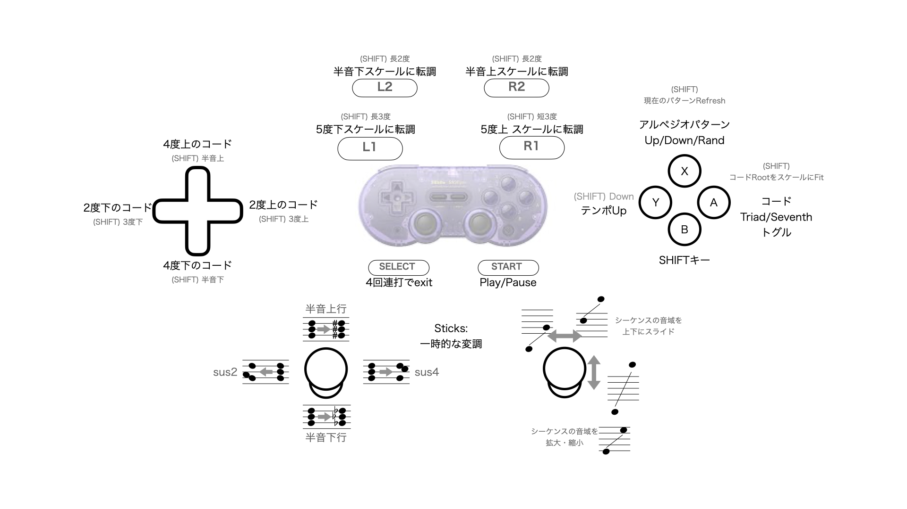

# WiiChorder: Chord Progression Game Pad Controller

# What is this app? / このアプリは？

An app designed for manipulating chord progressions not with a musical instrument, but with a game controller that feels right in your hands.
By connecting a game controller to a Raspberry Pi, you can map all the buttons in an intuitive layout, making it easier to control, modulate, and play chord arpeggio MIDI sequences with a degree of randomness.

コード進行を、楽器ではなく、手になじむゲームコントローラでいじるためのアプリ。
ゲームコントローラをRasPiにつないで、すべてのボタンを直感的な配置で、操作しやすくマップすることで、
コードアルペジオのMIDIシーケンスを多少の偶然性をもってコントロール・変調・演奏できる。


# Purpose / 目的

To find musically interesting chord progressions by chance. Not just randomly generated chords, but randomness based on certain music theories.
音楽的におもしろい偶然のコード進行を見つけたい。ただランダムにコードが生成されるのではなく、一定の音楽理論に基づいたランダム性を追求した。


# Requirements / 必要なもの

## Device / デバイス
* Raspberry Pi Zero W 2 (any model would work)
* MIDI USB Musical Instrument
* USB cable for MIDI
* Game controller (for me, "8bitdo SN30 Pro" connected via Bluetooth)

MIDI signals are only sent to a fixed MIDI Port. The Raspberry Pi itself does not produce sound.
MIDI信号は、固定のMIDI Portに送信されます。RasPi本体では音は鳴りません。


## Necessary Python Libraries / Pythonの必要なライブラリ
```
pip install python-rtmidi
pip install mido
pip install pygame
```

# Device Setup / デバイスの設定

## Raspberry Pi
Just a standard setup with 32-bit CLI installed, including:
* Wi-Fi configuration
* SSH enabled
* samba set up to "/home/pi/Public"
* Connecting 8bitdo SN30 to Raspberry Pi via CLI/bluetoothctl

RasPiは普通に、32bit CLIをインストールし、
* Wi-Fi設定
* SSH Enable
* /home/pi/Public に Sambaを設定
した程度


## 8bitdo SN30
(reference) https://manual.8bitdo.com/sn30pro/sn30pro_bluetooth_macos.html
(reference) https://note.com/cloha/n/n26bb823ed599

Use the following commands with bluetoothctl to make a Bluetooth connection. 
To connect, turn on the device with Start + "B Button" for Raspberry Pi (for MacOS, it's Start + A).

下記のコマンドで、bluetoothctl を使ってBluetooth接続する。
この時、Start+"Bボタン"で起動、がRasPiで接続可能なポイント。(MacOSの場合は、Start+A)

```
bluetoothctl
scan on
pair E4:17:D8:35:78:73  <= address depends
connect E4:17:D8:35:78:73
trust E4:17:D8:35:78:73
```

## SN30 Key Mapping / ゲームコントローラのキーマップ

Key mapping can differ depending on the startup button (Start+A or B or...). 
I referred to the following guide, but ended up just printing and finding out myself.
https://heavymoon.org/2022/12/03/8bitdo-ns30pro/

キーマップも、起動ボタン(Start+A or B or...)によって異なる。
これを参考にしたけど、結局はprintして自分で見つけた。
https://heavymoon.org/2022/12/03/8bitdo-ns30pro/


# Auto Start / 自動起動

## Python Program / Pythonプログラム
For headless operation of the Raspberry Pi, auto-starting the program is essential. 
However, the app won't start or will terminate if it can't initialize the MIDI USB and game controller. Thus, auto-starting is desired.

I tried daemon-based auto-starting as seen here https://www.pc-koubou.jp/magazine/52061, but it didn’t work well, possibly due to permissions issues with pygame. As an easier solution, I used:

A ".running" file for life check, and
crontab for auto-starting.
1. Creating a Life Check File
In WiiChorder.py, once the controller is connected and ready to play, touch the ".running" file every minute to update its timestamp.

2. Checking the Life Check File
In check_and_run.sh, check for the existence and timestamp of the ".running" file, and if it's old, automatically start WiiChorder.py.

```
# crontab
*/1 * * * * /home/pi/Public/check_and_run.sh
```


RasPiをヘッドレスで運用するため、プログラムの自動起動は必須。
ただ、プログラムの使用上、MIDI USBとゲームコントローラの初期化ができないと、アプリが起動しない or アプリがTerminateする。そのため、自動起動したい。
https://www.pc-koubou.jp/magazine/52061　のようなデーモンによる自動起動もやったが、
pygame周りか？の権限関係で、いまいちうまくいかない。そのため手軽に、
* ライフチェック用の「.running」というファイルを利用して、
* crontab による自動起動を採用した。

### 1. ライフチェックファイルの生成
WiiChorder.py の中で、コントローラが接続して、演奏可能になった時点で、
1分おきに「.runnning」ファイルに touch して、日時更新するようにした。

### 2. ライフチェックファイルの確認
check_and_run.sh の中で、「.running」というファイルの存在確認＆更新日時確認をして、
古ければ自動的に WiiChorder.py を起動するように設定。

```
# crontab -e
*/1 * * * * /home/pi/Public/check_and_run.sh
```


## Automating Reconnection to Bluetooth / Bluetoothへの再接続の自動化
When connecting the game controller via Bluetooth, Raspberry Pi's CLI doesn't automatically restore the connection. 
I used the following guide as is (thanks!).
https://qiita.com/noraworld/items/c0b8988c7efb7f877608

ゲームコントローラをBluetooth接続する場合、RasPiのCLIでは、自動的に接続を復元してくれない。
下記の記事をそのまま利用させていただいた。(感謝!)
https://qiita.com/noraworld/items/c0b8988c7efb7f877608


# How to Use / 使い方
Place check_and_run.sh and WiiChorder.py in /home/pi/Public,
and set up the crontab. 
It should auto-start, and you can start playing when the game controller is connected.
For what each button on the controller does, please see manual.jpg.

/home/pi/Public に
* check_and_run.sh
* WiiChorder.py
を配置して、crontab を設定しておけば、自動で起動する。
ゲームコントローラが接続せれたら、演奏が始まるはず。
その他、コントローラの各ボタンで何が起こるかは、manual.jpg をご覧ください。




# Application / 応用
Feel free to modify it. I believe the ideal layout varies from person to person.

いろいろ改造してください。きっと人によってしっくりくる配置は違うと思うので。


# Tools / 備忘録

* Manual for bluetoothctl
  https://qiita.com/noraworld/items/55c0cb1eb52cf8dccc12

* To manually run Python in the background
  nohup python WiiChorder.py &

* To reset the 8bit (when switching Raspberry Pi units)
  Hold L+R and then hit Start to turn it on. Then flash with whatever firmware.

* Command to transfer files to Raspberry Pi via scp
  scp ./WiiChorder.py pi@piw2.local:/home/pi/Public
